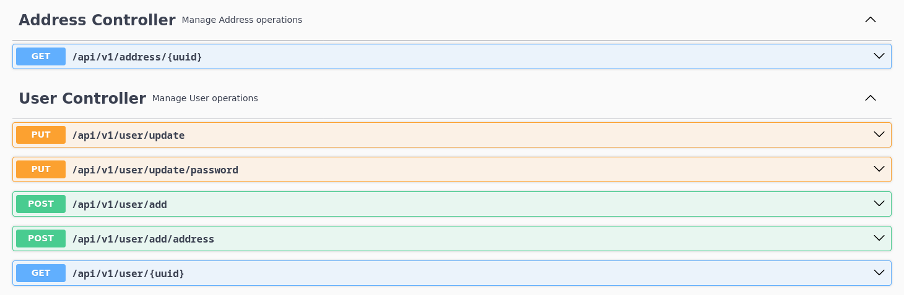
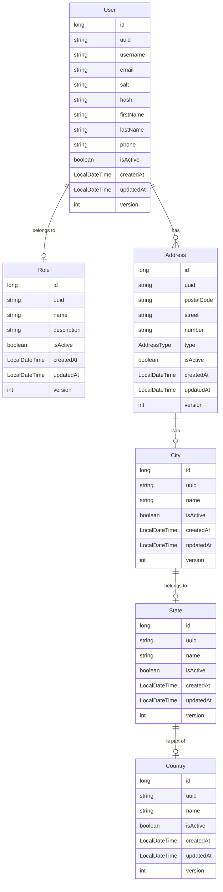

# User Microservice

### Dependencies
- Java 17
- Spring Boot
- Spring Web
- Spring Security
- Spring Data Jpa
- OpenAI (Swagger)
- Lombok

### Exceptions
Exceptions are handled using `RestControllerAdvice`.

### Endpoints

All endpoints return an `ResponsePayload` with a message indicating the operation success or failure and a `ResponseBody` if retrieving data.

### In progress
- Validation will be done with annotations;
- Security will be handled by Spring Cloud Gateway;

### Diagram
